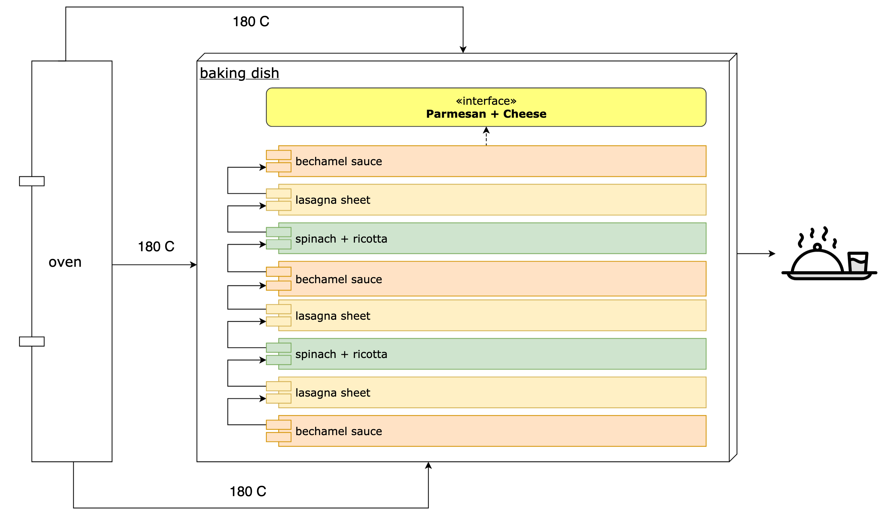

# Steffens Spinatlasagne

To get the lasagna recipe, you must implement and execute the following report [z_lasagne_rezept.abap](z_lasagne_rezept.abap)

Process architectural overview:


# Report Output

```
========== Zutaten ==========
450g Spinat
150g Ricottakäse
Bechamel-Sauce
Lasagneblätter
Geriebener Käse (Emmentaler)
60g Parmesan gerieben

========== Zubereitung ==========
1. Spinat und den geriebenen Ricottakäse mischen
2. Bechamel-Sauce in Backform verteilen
3. Lasagneblätter auslegen
4. Spinat-Käse-Schicht verteilen
5. Lasagneblätter auslegen
6. Bechamel-Sauce verteilen
7. Spinat-Käse-Schicht verteilen
8. Lasagneblätter auslegen
9. Bechamel-Sauce verteilen
10. Geriebenen Käse (Emmentaler) verteilen
11. Parmesan verteilen
12. 25-30 Minuten bei 180 Grad Umluft backen
```
